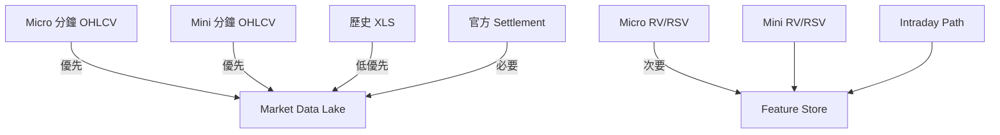

# LOCAL DATA IMPORT PLAN (Phase 2V-B.1)

> 本計劃僅供規劃參考，本棒不實際匯入。僅在報告明確標註 `APPROVED_FOR_IMPORT` 後，下一棒才執行匯入。

---

## 1. 候選資料集與匯入優先級

| 優先級 | 資料集 | 來源路徑 | 目的地 | 所需轉換 | 語義映射 | 日期映射 | 合約映射 | 去重規則 | 驗證規則 | PIT 限制 |
|--------|--------|----------|--------|----------|----------|----------|----------|----------|----------|----------|
| P0 | Micro 分鐘 OHLCV (2023-2026) | D:\data\N225microf_*.zip | market_ai_hub.data.raw.ose_micro_minute | XLSX→Parquet, cp950→UTF-8, 中文標題→英文 | Date/Time/Open/High/Low/Close/Volume | Date+Time → UTC timestamp | 隱含 JNU 系列，需補 contract_month | SHA256 去重 | OHLC 邏輯檢查、volume≥0、價格合理範圍 | POINT_IN_TIME_LIMITED (無 available_at) |
| P0 | Mini 分鐘 OHLCV (2012-2026) | D:\data\N225minif_*.zip | market_ai_hub.data.raw.ose_mini_minute | 同上 | 同上 | 同上 | 隱含 JNM 系列 | 同上 | 同上 | POINT_IN_TIME_LIMITED |
| P1 | Micro RV/RSV (QROS derived) | QROS/data/derived/jnu_225labo_micro/ | market_ai_hub.feature.realized_vol.micro | CSV→Parquet | rv_5m/rsv_pos/rsv_neg/day/night session | trading_date → date | 無合約月份 | SHA256 去重 | RV≥0, RSV≥0, RV≥RSV | 可 PIT (trading_date 即 available_at) |
| P1 | Mini RV/RSV | QROS/data/derived/jnu_225labo/ | market_ai_hub.feature.realized_vol.mini | 同上 | 同上 | 同上 | 同上 | 同上 | 同上 | 同上 |
| P2 | Micro Intraday Path | QROS/data/derived/jnu_225labo_micro_path/ | market_ai_hub.feature.intraday_path.micro | 同上 | first30/middle/last30/day_session return | 同上 | 同上 | 同上 | 收益率合理範圍 | 同上 |
| P3 | Micro 歷史 XLS (2006-2011) | D:\data\225mini*d.xls | market_ai_hub.data.raw.ose_mini_daily_legacy | XLS→Parquet (需 xlrd) | 需人工確認欄位 | 需人工確認 | 需人工確認 | SHA256 去重 | 基本合理性 | POINT_IN_TIME_LIMITED |
| P4 | 官方 Settlement (缺失) | JPX/J-Quants API | market_ai_hub.data.raw.ose_micro_settlement | API→Parquet | settlement_price, contract_month | settlement_date | contract_code | API 去重 | settlement_price > 0 | 官方 available_at = T+1 結算 |

---

## 2. 語義映射細節

### 2.1 Micro 分鐘 OHLCV (XLSX in ZIP)
| 原始欄位 (中文) | 標準欄位 | 型態 | 說明 |
|----------------|----------|------|------|
| 日期 | date | DATE | 交易日期 |
| 時間 | time | TIME | 分鐘時間 (HH:MM) |
| 開盤 | open | FLOAT | 開盤價 |
| 最高 | high | FLOAT | 最高價 |
| 最低 | low | FLOAT | 最低價 |
| 收盤 | close | FLOAT | 收盤價 |
| 成交量 | volume | BIGINT | 成交量 (口數) |

> ⚠️ 中文欄位名因 cp950 編碼顯示亂碼，實際內容推測為上述對應。匯入前需人工確認前 3 列樣本。

### 2.2 Micro RV/RSV (QROS)
| 原始欄位 | 標準欄位 | 型態 | 說明 |
|----------|----------|------|------|
| trading_date | date | DATE | 交易日期 |
| rv_5m | rv_5m | FLOAT | 5分鐘已實現波動率 |
| rsv_pos_5m | rsv_pos_5m | FLOAT | 正半波動率 |
| rsv_neg_5m | rsv_neg_5m | FLOAT | 負半波動率 |
| day_session_rv | day_session_rv | FLOAT | 日盤 RV |
| night_session_rv | night_session_rv | FLOAT | 夜盤 RV |
| n_5m_returns | n_5m_bars | INT | 5分鐘 bar 數 |
| valid_5m_bars | valid_5m_bars | INT | 有效 5分鐘 bar 數 |
| session_coverage_ratio | session_coverage | FLOAT | 交易時段覆蓋率 |

### 2.3 合約代碼映射表
| 資料集 | 隱含商品 | 交易所代碼 | 內部代碼 | 合約月份 |
|--------|----------|------------|----------|----------|
| Micro 分鐘 OHLCV | Nikkei 225 Micro | OSE | JNU | 無 (連續序列) |
| Mini 分鐘 OHLCV | Nikkei 225 Mini | OSE | JNM | 無 |
| Micro RV/RSV | Nikkei 225 Micro | OSE | JNU | 無 (單一序列) |
| Mini RV/RSV | Nikkei 225 Mini | OSE | JNM | 無 |

> ⚠️ 所有資料均為連續序列，無合約月份欄位，無法區分不同月份合約。若需合約級回測，需額外映射表。

---

## 3. 日期映射規則

| 來源欄位 | 目標欄位 | 轉換規則 | 時區處理 |
|----------|----------|----------|----------|
| Date (YYYY-MM-DD) | date | DATE | UTC |
| Time (HH:MM) | time | TIME | JST → UTC (+9h) |
| trading_date (RV/RSV) | date | DATE | UTC |
| Date + Time (分鐘 OHLCV) | timestamp_utc | TIMESTAMP | JST → UTC (+9h) |

> ⚠️ 原始資料無時區資訊，假設為 JST (UTC+9)。匯入時需明確標註。

---

## 4. 合約映射規則

| 來源 | 目標欄位 | 映射規則 |
|------|----------|----------|
| Micro 分鐘 OHLCV | contract_code | JNU (固定) |
| Mini 分鐘 OHLCV | contract_code | JNM |
| Micro RV/RSV | contract_code | JNU (單一序列) |
| Mini RV/RSV | contract_code | JNM |

> ⚠️ 缺合約月份 - 所有資料已合併為連續序列。若需合約級回測，需外部映射表 (JPX 官方商品規格表)。

---

## 4. 去重規則

| 層級 | 鍵 | 說明 |
|------|------|------|
| 檔案級 | SHA256 | 完整檔案去重 (已完成) |
| 列級 (OHLCV) | (date, time, contract_code) | 分鐘級唯一鍵 |
| 列級 (RV/RSV) | (date, contract_code) | 日級唯一鍵 |
| 檔案重複 | SHA256 + 容器路徑 | D:\data ↔ QROS\personal_licensed 為備份關係 |

---

## 5. 驗證規則

| 檢查項目 | 規則 | 失敗處理 |
|----------|------|----------|
| OHLC 邏輯 | low ≤ open,high,close ≤ high | 標記 INVALID_OHLC |
| 價格合理 | 0 < price < 1,000,000 (日經點數) | 標記 PRICE_OUT_OF_RANGE |
| 成交量非負 | volume >= 0 | 標記 NEGATIVE_VOLUME |
| RV/RSV 非負 | rv_5m >= 0, rsv_* >= 0 | 標記 NEGATIVE_RV |
| RV ≥ RSV | rv_5m >= rsv_pos_5m + rsv_neg_5m | 標記 RV_LT_RSV |
| 日期連續性 | 交易日無大跳躍 (>5日) | 標記 DATE_GAP |
| 合約代碼一致 | 全檔案同一 contract_code | 標記 CONTRACT_MISMATCH |

---

## 5. PIT 限制說明

| 資料集 | PIT 等級 | 說明 |
|--------|----------|------|
| Micro/Mini 分鐘 OHLCV | POINT_IN_TIME_LIMITED | 無 available_at，無法嚴格保證 PIT |
| Micro/Mini RV/RSV | 可推斷 PIT | trading_date 即交易日結束，transform_version 可追溯 |
| 歷史 XLS | POINT_IN_TIME_LIMITED | 無時間戳欄位 |

---

## 6. 匯入順序與依賴

---

## 6. 風險與待解決事項

| 風險 | 影響 | 緩解措施 |
|------|------|----------|
| 中文欄位名編碼損壞 | 欄位語義不確定 | 人工抽樣驗證前 10 列 |
| 缺合約月份 | 無法合約級回測 | 從 JPX 官方商品規格表補齊 |
| 無官方 Settlement | 無法驗證結算價預測 | 申請 J-Quants/JPX Data Cloud |
| PIT 不嚴格 | 可能 look-ahead bias | 僅用於探索性研究，正式回測需官方 PIT |

---

## 7. 核准簽署

| 角色 | 姓名 | 簽署 | 日期 |
|------|------|------|------|
| Data Engineer | - | ☐ | - |
| Quant Researcher | - | ☐ | - |
| Risk Manager | - | ☐ | - |

---

> 本計劃僅供規劃參考，未經核准不得執行匯入。
> 僅在報告明確標註 APPROVED_FOR_IMPORT 後，下一棒才可執行匯入。