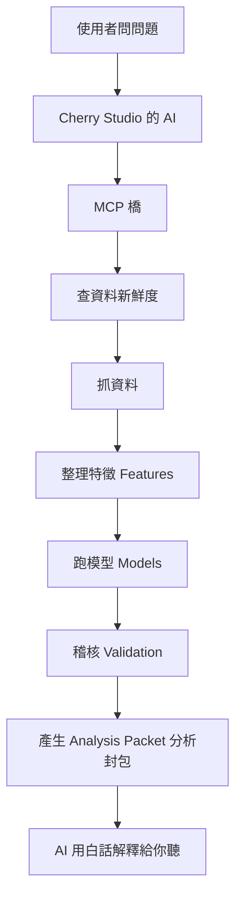
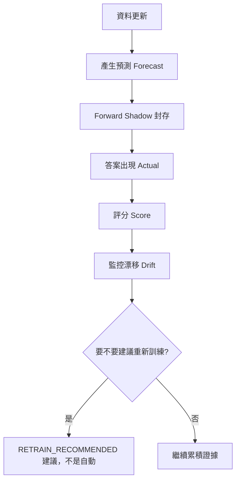

# MARKET_AI_HUB 怎麼運作（白話版）

> 用生活化的比喻，讓完全不懂技術的人也能懂這套系統。

---

## 每個零件是什麼？

| 名稱 | 比喻 | 白話 |
|------|------|------|
| Cherry Studio | 對話介面 | 你打字問問題的地方 |
| LLM（大型語言模型） | 研究助理 / 主腦 | 聽懂你的問題、統整答案的那顆「大腦」 |
| MCP | 橋 | AI 跟 MARKET_AI_HUB 溝通的橋 |
| MARKET_AI_HUB | 金融研究工具箱 | 一堆研究工具（查資料、跑模型、驗證） |
| Providers | 資料來源 | 哪裡來的市場資料 |
| Models | 不同研究員 | 各自用不同方法做預測 |
| Validation | 稽核員 | 檢查模型到底準不準 |
| Forward Shadow | 封存 + 評分 | 把「今天的預測」封存起來，等未來答案出現再打分數 |
| Resource Governor | 資源守門員 | 避免把整台電腦吃到卡死 |

---

## 問一個問題的流程

## 每天的生命週期

---

## 最重要的一句話

**「每天新增資料」 ≠ 「每天修改模型」。**

系統每天做的是：更新資料 → 做預測 → 封存 → 評分 → 監控。
它**不是**每天偷偷重新訓練模型。

## 三個關鍵開關（目前都是關的）

| 開關 | 意思 | 目前 |
|------|------|------|
| AUTO_TRAIN | 自動訓練模型 | ❌ 關閉 |
| AUTO_FINE_TUNE | 自動微調大模型 | ❌ 關閉 |
| AUTO_PROMOTE | 自動把模型升級成「可信」 | ❌ 關閉 |
